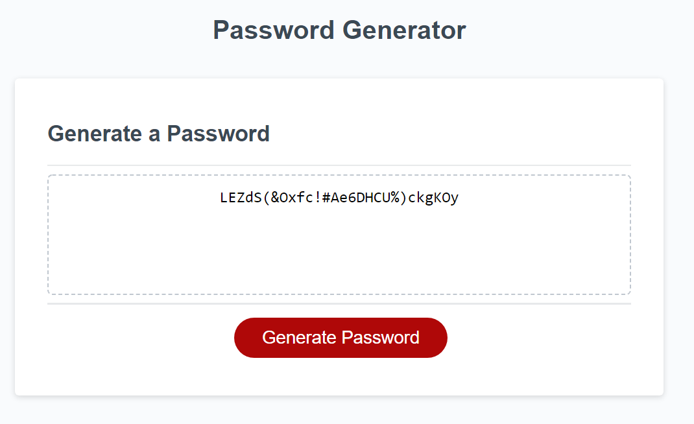

# passwordGenerator

📖Weekly Challenge 3
Implemented the following user story:

## User Story

AS AN employee with access to sensitive data
I WANT to randomly generate a password that meets certain criteria
SO THAT I can create a strong password that provides greater security

## Acceptance Criteria
GIVEN I need a new, secure password
WHEN I click the button to generate a password
THEN I am presented with a series of prompts for password criteria
WHEN prompted for password criteria
THEN I select which criteria to include in the password
WHEN prompted for the length of the password
THEN I choose a length of at least 8 characters and no more than 128 characters
WHEN asked for character types to include in the password
THEN I confirm whether or not to include lowercase, uppercase, numeric, and/or special characters
WHEN I answer each prompt
THEN my input should be validated and at least one character type should be selected
WHEN all prompts are answered
THEN a password is generated that matches the selected criteria
WHEN the password is generated
THEN the password is either displayed in an alert or written to the page

## About the site

When the button is clicked you will be prompted if you want to customize the password. If you click cancel it will generate a random password with a random length. If you click "ok" to customize the password you will be prompted to choose the length and what characters are allowed. 

## Assets

The URL is: 

A screenshot of the site is in the images folder: [assets](./assets/images/siteScreenshot.PNG)

Repository located at: https://github.com/RikRox/passwordGenerator
